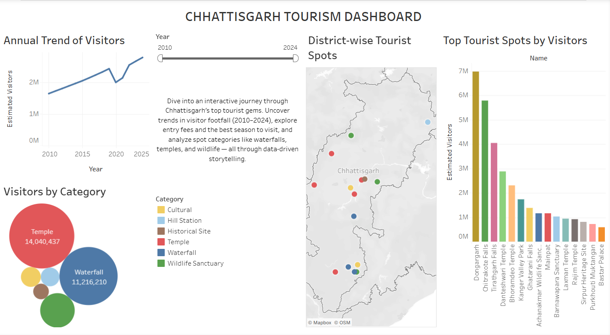

# Chhattisgarh-Tourism-Dashboard

This project is an interactive Tableau dashboard showcasing major tourist destinations across **Chhattisgarh, India**. It visualizes tourism trends over the years, offering insights for travelers, tourism authorities, and data enthusiasts.

## 📊 Live Dashboard
🔗 https://public.tableau.com/views/CG_Tourist_Spots/Dashboard1?

## 📂 Dataset Included
- `chhattisgarh_tourist_spots_with_visitors.csv` – Main dataset with tourist spots, entry fees, and annual visitor counts from 2010 to 2024.

## 🖼️ Dashboard Preview
> *(Include a screenshot named `dashboard_screenshot.png` in your repo and GitHub will show it here)*

## 🔍 Dashboard Features
- Visual breakdown of **key tourist attractions** (e.g., waterfalls, temples, wildlife sanctuaries)
- **Year-wise visitor trends** from 2010 to 2024
- **Entry fee** insights by location
- Interactive filters by category and district
- Designed for **data-driven decision making** in tourism planning

## 🛠️ Tools Used
- [Tableau Public](https://public.tableau.com/)
- Microsoft Excel (for data cleaning and formatting)
- GitHub (for project hosting and documentation)

## 📌 Project Goals
- Practice end-to-end data visualization using real-world tourism data
- Make insights accessible for public or academic use
- Showcase Tableau skills in a portfolio-friendly format

